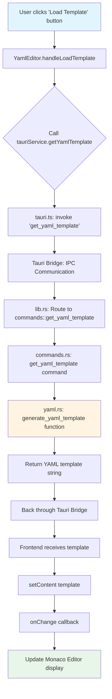
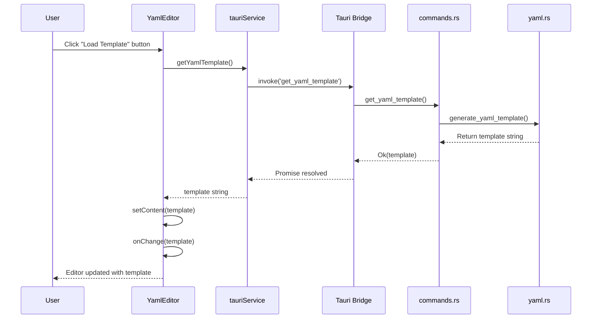
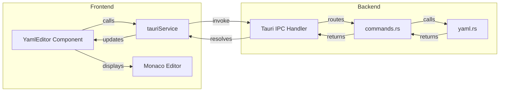

# Flow Load Template bằng AI

## Tổng quan
Flow này mô tả quá trình load YAML template từ backend Rust (Tauri) lên frontend React để người dùng có thể sử dụng template này để tạo test scenario với AI.

## Flow Diagram



## Chi tiết các bước

### 1. Frontend - User Interaction
**File:** `src/components/scenario/YamlEditor.tsx`

```typescript
const handleLoadTemplate = async () => {
  try {
    const template = await tauriService.getYamlTemplate();
    setContent(template);
    onChange?.(template);
  } catch (e) {
    console.error('Failed to load template:', e);
  }
};
```

- User click button với icon `FileText` trong toolbar
- Function `handleLoadTemplate` được trigger
- Gọi `tauriService.getYamlTemplate()` để lấy template từ backend

### 2. Frontend - Tauri Service Layer
**File:** `src/services/tauri.ts`

```typescript
async getYamlTemplate(): Promise<string> {
  return invoke('get_yaml_template');
}
```

- Service layer sử dụng Tauri's `invoke` API
- Gửi command `'get_yaml_template'` qua IPC bridge

### 3. Tauri Bridge - IPC Communication
- Tauri framework xử lý IPC communication giữa frontend và backend
- Command được route đến Rust backend handler

### 4. Backend - Command Registration
**File:** `src-tauri/src/lib.rs`

```rust
.invoke_handler(tauri::generate_handler![
    // ... other commands
    commands::get_yaml_template,
])
```

- Command được đăng ký trong Tauri app builder
- Route đến `commands::get_yaml_template` function

### 5. Backend - Command Handler
**File:** `src-tauri/src/commands.rs`

```rust
#[tauri::command]
pub async fn get_yaml_template() -> Result<String, String> {
    Ok(generate_yaml_template())
}
```

- Tauri command handler nhận request
- Gọi function `generate_yaml_template()` từ module `yaml`
- Trả về `Result<String, String>`

### 6. Backend - Template Generation
**File:** `src-tauri/src/scenario/yaml.rs`

```rust
pub fn generate_yaml_template() -> String {
    r#"# Test Scenario YAML Template
# This file can be used by AI tools to generate test scenarios

name: "My Test Scenario"
description: "Description of what this scenario tests"
priority: medium

variables:
  baseUrl: "http://localhost:3000"
  authToken: ""

steps:
  - name: "Login Request"
    request:
      method: POST
      url: "{{ baseUrl }}/api/auth/login"
      # ... more template content
"#.to_string()
}
```

- Function tạo YAML template string với comments đầy đủ
- Template bao gồm:
  - Metadata (name, description, priority)
  - Variables section
  - Steps examples (request, delay, script)
  - Comments hướng dẫn cho AI tools

### 7. Response Flow
- Template string được trả về qua Tauri bridge
- Frontend nhận Promise resolution
- Template được set vào component state
- Monaco Editor tự động update với nội dung mới

## Sequence Diagram



## Component Architecture



## Template Structure

Template YAML được generate có cấu trúc:

```yaml
# Metadata
name: "My Test Scenario"
description: "..."
priority: medium

# Variables
variables:
  baseUrl: "http://localhost:3000"
  authToken: ""

# Steps
steps:
  - name: "Login Request"
    request: {...}
    extract: {...}
    assertions: {...}
  - name: "Wait"
    delay: {...}
  - name: "Custom validation"
    script: {...}
  - name: "Get User Profile"
    request: {...}
    assertions: {...}
```

## Use Cases

1. **AI Tool Integration**: Template được thiết kế để AI tools có thể đọc và generate test scenarios
2. **User Guidance**: Cung cấp structure và examples cho users mới
3. **Quick Start**: Giúp users nhanh chóng bắt đầu tạo scenario mà không cần viết từ đầu

## Error Handling

- Frontend có try-catch để handle errors
- Backend trả về `Result<String, String>` để handle errors
- Console error logging nếu load template fails
